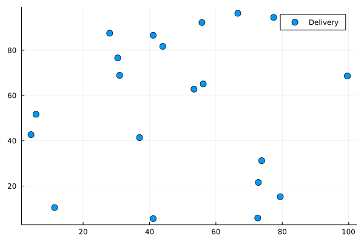
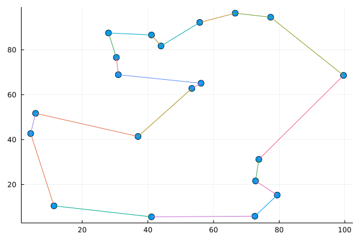

# TSP in Julia
Traveling Salesman Problem [TSP](https://en.wikipedia.org/wiki/Travelling_salesman_problem) is a classic combinatorial optimization problem.
Given set of points on a plane

Find a path that visitis each point exactly once, minimize the total distance.

`TSP.ipynb` notebook implements Miller–Tucker–Zemlin method in Julia with [JuMP](https://jump.dev/JuMP.jl/stable/) lib for modeling optimization problems.
Two great blog posts that helped me along the way:
- https://co-enzyme.fr/blog/traveling-salesman-problem-tsp-in-cplex-opl-with-miller-tucker-zemlin-mtz-formulation/
- https://towardsdatascience.com/a-comprehensive-study-of-mixed-integer-programming-with-jump-on-julia-part-3-847ad5b3c625

## Dependancies
In order to run this notebook you need Julia 1.7, julia kernel for Jupyter and following Julia libs (available by pkg)
- Plots
- GLPK
- JuMP